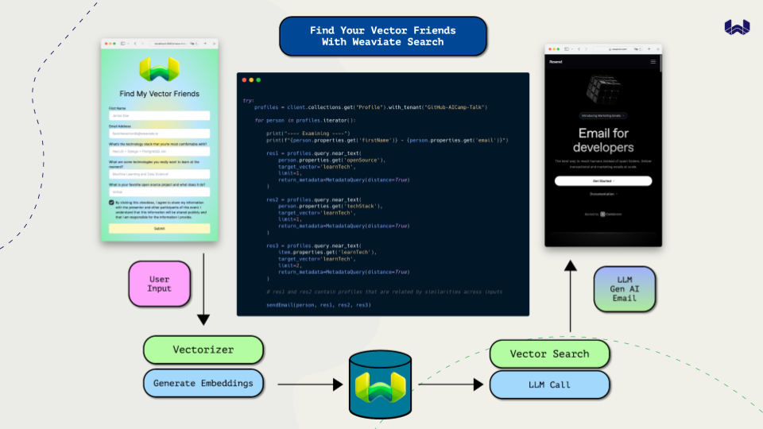

# Find your Vector Friends with Weaviate Vector Search



This project is a unique platform that leverages the power of Weaviate Vector Search to connect people based on their similarities. By analyzing various aspects of a user's profile, our system can identify and match individuals who share common traits, interests, or characteristics.

The underlying technology is Weaviate, an open-source, AI Native Vector Database. Weaviate uses embedding models to determine semantically related data in high dimensional vector space to provide a unique search experience that allows you to not just match exact terms but also related concepts.

In this application, we use this vector search capability to analyze user profiles and find the closest matches based on the vector distances. This allows us to suggest friends to users who are most similar to them, fostering connections that are more likely to be meaningful and rewarding.


## Getting Started

Make sure you have a .env with the following available to your project

```
WEAVIATE_HOST_URL=<INSERT_YOUR_HOST_URL>
WEAVIATE_API_KEY=<INSERT_YOUR_API_KEY>
OPENAI_API_KEY=<INSERT_YOUR_API_KEY>
```

If you want this to send emails for you, add your Resend API Key to `.env`.

```
RESEND_API_KEY=<INSERT_YOUR_RESEND_API_KEY>
```

Now, run the development server:

```bash
nvm use 19.19.0
```

```bash
npm run dev
# or
yarn dev
# or
pnpm dev
# or
bun dev
```

Open [http://localhost:3000](http://localhost:3000) with your browser to see the result.

You can start editing the page by modifying `app/page.tsx`. The page auto-updates as you edit the file.

This project uses [`next/font`](https://nextjs.org/docs/basic-features/font-optimization) to automatically optimize and load Inter, a custom Google Font.

## Learn More

* Come to [Weaviate](https://weaviate.io) to learn more about Weaviate.
* Check out this [Hybrid Search webinar](https://events.weaviate.io/hybrid-search-webinar).
* Get started on [Weaviate Cloud Services](https://console.weaviate.cloud) today!